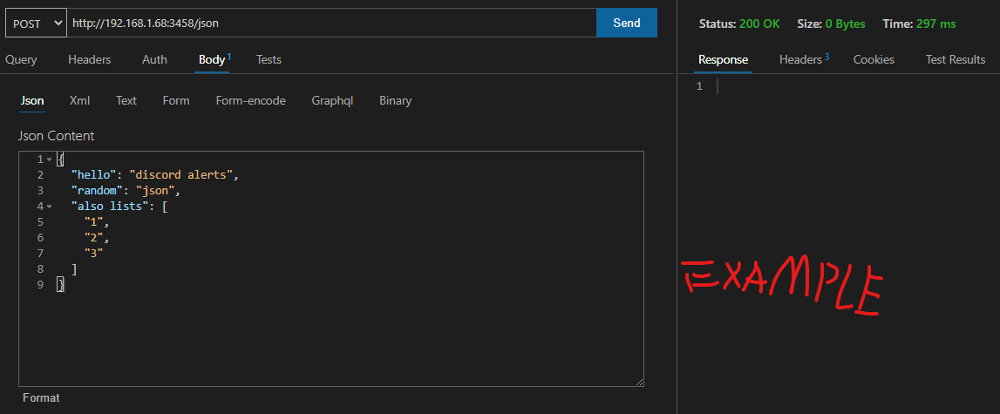
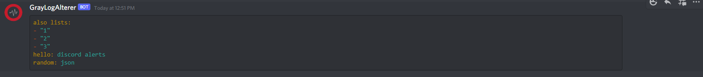
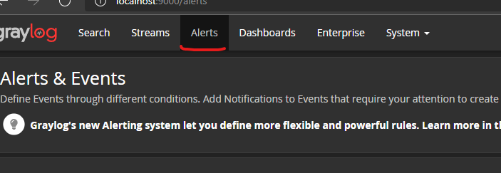
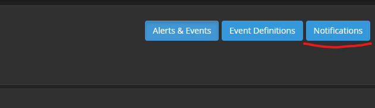
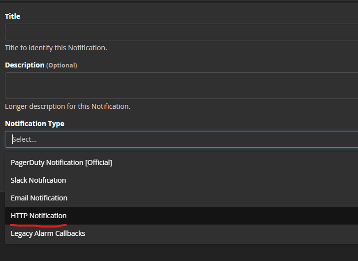
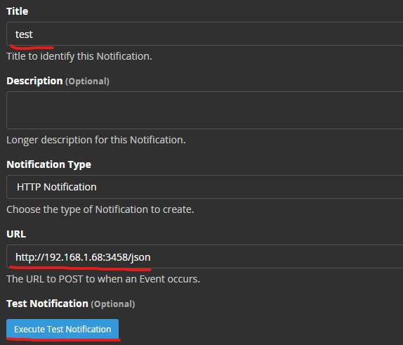
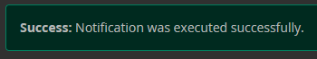
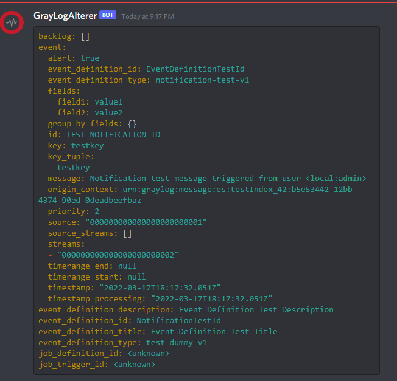

# <p  align="center" style="font-family:courier;font-size:180%" size=212px> DISCORD ALERTS  </p> 

[](LICENSE)
[](https://hub.docker.com/repository/docker/dangdancheg/discord_alerts)
[](https://app.swaggerhub.com/apis/Dancheg97/DISCORD_ALERST/1.0.0)


<p align="center">
 


</p>


This project is made to show how to send discord alters from http requests. This can be used to quickly recieve importand messages from log-hubs, or orther sources.

You can connect this alert system to:
- GrayLog
- ELK
- Any application with http library

This bot currently accepts input in `json` format, but it is possible to reconfigure it for another input type.


# Bot setup process:

1) Create discord bot - go to [discord applications](https://discord.com/developers/applications) and create new application


2) Go to `bot`, and press `add bot`


3) Press reset token, and save token in some safe place (definetly .txt file, called tokens or passwords :D)


5) Go to URL-Genrator, and generate URL with required permissions


6) Open that URL in browser on new page, add bot to your server


7) Go to your discord channel, and extract channel id from channel link


8) Paste your token and channel id to docker-compose or .env file depending on your build type


Launch the bot (with docker or build from scratch), and enjoy!

# Run using docker compose:

Add to your `docker-compose.yml` file:

```yaml
version: '3'
services:
  discord_alerts:
    image: dangdancheg/discord_alerts:latest
    ports:
      - 3458:3458
    environment:
      - TOKEN=PASTE_YOUR_DISCORD_TOKEN
      - CHANNEL_ID=PASTE_CHANNELID_FROM_CHANNEL_LINK
      - PORT=3458
```

And run `docker compose up`

# Run using go:

1) Clone git repo
```bash
git clone https://github.com/Dancheg97/discord_alerts ...
```
2) Navigate to cloned directory
3) Set the .env file with credentials
```python
TOKEN=YOUR_TOKEN
CHANNEL_ID=YOUR_CHAN_ID
PORT=3458
```
2) Run using go
```bash
go run .
```

# Http test:

You can send simple request using http library:



You should recieve following message in your channel:




# Set up for graylog:

1) Navigate to alerts folder:



2) Open notifications page:




3) Select HTTP notification:



4) Type title, URL and press `execute test notification`



5) You should recieve message like this in graylog/discord:





